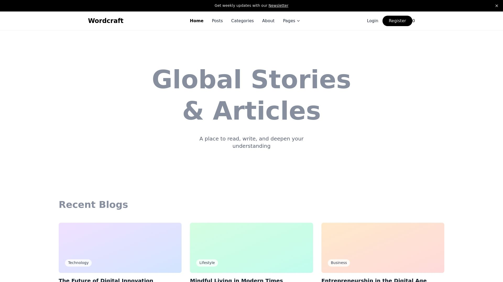

React Blog
A blog platform where users can sign in, create posts, and edit/delete their own posts.
Technologies

React
Tailwind CSS
DaisyUI
Axios
React-Toastify
React Router
JSON Server Auth

Features

User authentication with JSON Server Auth
Create, edit, and delete posts for authenticated users
Responsive design with Tailwind CSS and DaisyUI
Toast notifications for user actions using React-Toastify

Installation

Clone the repository: git clone https://github.com/Islam-mohamed-74/React-Blog
Install dependencies: npm install
Run JSON Server: npx json-server-auth db.json
Run the app: npm start

Live Demo https://react-blog-theta-vert.vercel.app/
View Live Demo 
